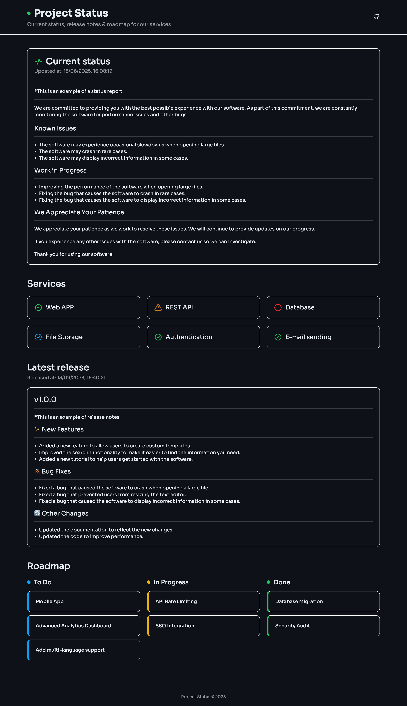

# Project Status
##### This project is built using [VITE](https://vitejs.dev/) with React TypeScript template
#### Live example: https://project-status.dariodumlijan.com

Zero cost SPA (React) app for displaying projects'/softwares' current status, release notes & roadmap

Using [GitHubs' API](https://docs.github.com/en/rest/quickstart?apiVersion=2022-11-28) we are getting
- **Release notes**, from projects' [latest release](https://github.com/dariodumlijan/project-status/releases)
- **Current status**, from [this issues'](https://github.com/dariodumlijan/project-status/issues/1) description
- **Individual service statuses**, from [these sub issues](https://github.com/dariodumlijan/project-status/issues/1)
- **Roadmap**, from [this project](https://github.com/users/dariodumlijan/projects/2)

---

## Deployment
### Setup GitHub tokens

You can find how to get a GitHub access tokens in [GitHubs' documentation](https://docs.github.com/en/authentication/keeping-your-account-and-data-secure/managing-your-personal-access-tokens)

In order to get full functionality as seen in the 

The `fine-grained` token only needs **read-only** repo access to:
- Releases
- Issues

The `classic` token only needs **read-only** access to:
- Projects

### Setup GitHub actions
Add the secrets/variables with the exact names listed below to you repos settings for actions

This will enable the GitHub action workflow for building and deploying the app to pass these values to the build so your app can communicate with GitHubs' API

**Secrets**

    ACCESS_TOKEN_REPO="<your_github_token_fine_grained>"
    ACCESS_TOKEN_PROJECT="<your_github_token_classic>"

**Variables**

    REPO_NAME="repo_name"
    REPO_OWNER="repo_owner"
    ISSUE_NUMBER="1"
    PROJECT_NUMBER="1"

### Setup GitHub pages
ATM there is some known problems when deploying to GitHub pages using tags
The current workaround for this can be found [here](https://github.com/actions/deploy-pages/issues/151#issuecomment-1491271099)

#### The quick quide

1. Go to project `Settings` > `Pages` > `Build and deployment`
    1. Set "**Source**" to "**GitHub Actions**"
1. Go to project `Settings` > `Environments`
    1. If not already there, create an environment called `github-pages`
    2. Set "**Deployment branches**" to "**All branches**"

### Deploy the app

Triggering the deploy job can be achieved in three ways:

#### 1. Via GitHub Project Page
Looking at the project main page on GitHub, on the right-hand side column, there is a section **"Releases"**.

Click on the button **"Create a new release"**.

Follow instructions, it is required to enter a tag such as **"v1.0.0"**

#### 2. Via Bash Script - Remotely
Using the script that lives in `scripts/deploy.sh`, you can call:

    yarn deploy --{TYPE}

Where `{TYPE}` can be `major`, `minor` or `patch`

#### 3. Via Console using GIT - Remotely
Go to the root of the project that was previously pulled from git.
In the console (always increment in the next release):

    git tag v1.0.0
    git push origin --tags

---

## Development
### Requirements
#### Node.js & yarn

Node version `>=22.0` and up needed to run the React scripts. And yarn to run the scripts and handle dependencies.

#### Project .env variables

    VITE_GITHUB_ACCESS_TOKEN_REPO="your_github_token_fine_grained"
    VITE_GITHUB_ACCESS_TOKEN_PROJECT="your_github_token_classic"
    VITE_GITHUB_REPO_NAME="repo_name"
    VITE_GITHUB_REPO_OWNER="repo_owner"
    VITE_GITHUB_ISSUE_NUMBER="1"
    VITE_GITHUB_PROJECT_NUMBER="1"

### Setup
Run the following commands to setup the project

    ~ cp .env.example .env
    ~ yarn install

### Commands

Install node dependencies:

    yarn (install)

Run dev server for development in the browser:

    yarn dev

To build application for production:

    yarn build

Run test handled by [vitest](https://vitest.dev/):

    yarn test

Get test coverage report:

    yarn test:coverage
